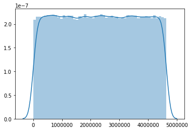

# Mutation-Simulator
**Version 2.0.2**

Mutation-Simulator is a Python 3.7 tool for simulating SNPs and SVs in any reference genome with cohesive documentation about implemented mutations. With Mutation-Simulator, the new file format Random Mutation Tables (RMT) is introduced, which gives more simulation power to the user by creating an interface for more natural simulations within specific genomes.
Mutation-Simulator provides 3 different modes to simulate SNPs, insertions, deletions, tandem duplications, inversions, translocations and interchromosomal translocations from the commandline or with highly configureable RMT files.
___
## Changelog
+ Added the option to set the sample name for the VCF file.
  + -n / --sample option in ARGS
  + sample_name meta keyword in RMT
+ Added the option to set the output file basename in all modes with the -o / --output option
+ Fixed deviating TiTv values
___

## Motivation
The simulation of mutations is a useful tool when benchmarking bioinformatics programs for variant identification and read alignment. While other simulation programs provide a set of tools to simulate mutated genomes, the lack of a central unification of multiple features, combined with the possibility to avoid a uniform distribution of mutations across the genome to enable the simulation of hot and cold spots, led towards the development of Mutation-Simulator.
This tool is not designed to be used as an evolution or inheritance simulator. It is mainly designed to assist other tools, for example de-novo assembly tools as a benchmarking tool. Mutation-Simulator solely provides the functionality to edit reference sequences into user specified configuration files ([RMT](https://github.com/mkpython3/Mutation-Simulator/blob/master/rmt-docs.pdf)) or commandline options. With Mutation-Simulator it is possible to test whether other tools handle SNPs and SVs correctly. RMT files aim to assist the user in creating a benchmarking dataset that is as close to biological data as possible.
## Features
* Not restricted to specific genomes / genome types
* Can operate with full genomes or small DNA fragments in single and multiple Fasta files
* Simple syntax
* [VCF](https://samtools.github.io/hts-specs/VCFv4.3.pdf) documentation of introduced SNPs and Structural Variations (SVs).
* [BEDPE](https://bedtools.readthedocs.io/en/latest/content/general-usage.html) documentation of **interchromosomal** translocations
* SNPs support transitions / transversion rates
* Many common SV types supported
* Translocations are marked with INS:ME and DEL:ME in the VCF file
* New RMT file format allows adjusting mutation-rates easily on a base resolution for more realistic mutation patterns
* Highly configurable
* Regions on the reference can be blocked (for example centromers)
## Methods
Mutation-Simulator is executable in 3 modes: Command-line Arguments (ARGS), Interchromosomal Translocations (IT) and Random Mutation Table (RMT). These modes can be selected with the second positional argument (mode):
```sh
./mutation-simulator.py file mode options
```
**ARGS** represents a quick way to simulate any kind of SV or SNP to a given amount and length randomly distributed across the reference genome. It provides no option to select specific areas on the genome for the mutation rates to apply to. All positions will be randomly generated across the genome on all chromosomes within the reference. The use case of ARGS confines to enabling the user to create a variant of the reference genome **if no specific settings need to be considered** and solely exists as a **quality of life feature***.

The **IT** mode serves **the same use case as ARGS**, though IT is used to generate breakend events at a specified rate. To simulate interchromosomal translocations first two chromosomes will be randomly paired. Secondly the amount of breaks is determined by the specified rate. Each break is randomly generated independently from the break positions of the paired chromosome, within the first and last position of the chromosomes with a minimum distance of one. The sequence after each breakpoint will then be swapped between the paired chromosomes. Same as ARGS, IT does not provide an option to define a different rate for each chromosome in the reference.

**RMT** is a combination of the aforementioned features with the addition to define ranges of higher and lower mutation rates using an RMT file. This file format allows the user to create **specific recreateable patterns** in which mutations can be generated at given rates and lengths across specific chromosomes. RMT also features meta-information about the genome, specific IT rates for each chromosome in the reference, standard values for unspecified areas, and blocking positions from mutating entirely.
### ARGS Mode
Option | Option | Description | Default
--- | --- | --- | :---:
-sn | -–snp | Rate of SNPs | 0
-snb | -–snpblock | Amount of bases blocked after SNP | 1
-titv | --transitiontransversion | Ratio of transitions / transversions | 1
-in | -–insert | Rate of insertions | 0
-inl | -–insertlength | Maximum length of inserts | 2
-inb | -–insertblock | Amount of bases blocked after insert | 1
-de | -–deletion | Rate of deletions | 0
-del | -–deletionlength | Maximum length of deletions | 2
-deb | -–deletionblock | Amount of bases blocked after deletion | 1
-iv | -–inversion | Rate of inversions | 0
-ivl | -–inversionlength | Maximum length of inversion | 2
-ivb | -–inversionblock | Amount of bases blocked after inversion | 1
-du | -–duplication | Rate of duplications | 0
-dul | -–duplicationlength | Maximum length of duplications | 2
-dub | -–duplicationblock | Amount of bases blocked after duplication | 1
-tl | -–translocation | Rate of translocations | 0
-tll | -–translocationlength | Maximum length of translocations | 2
-tlb | -–translocationblock | Amount of bases blocked after translocations | 1
-a | -–assembly | Assembly name for the VCF file | "Unknown"
-s | -–species | Species name for the VCF file | "Unknown"
-n | -–sample | Sample name for the VCF file | "SAMPLE"

The table shows all possible commandline options for ARGS. These options can be aligned with a specified value in one line. For example:
```sh
./mutation-simulator.py file args -sn 0.01 -in 0.005 -inl 5
```
On exit, Mutation-Simulator will generate the simulated genome named after the reference file: "$_ms.fa" together with the according VCF file "$_ms.vcf". This can be changed to custom output filenames with the **-o** or **--output** option that is available across all modes. The Fasta index file will be generated automatically by pyfaidx during execution.
### IT Mode
IT mode only features one additional argument:
```sh
./mutation-simulator.py file it interchromosomalrate
```
Mutation-Simulator will generate an according BEDPE file "$.bedpe" and the mutated genome "$_it.fa" named after the reference.

### RMT Mode
RMT solely requires an RMT file to operate:
```sh
./mutation-simulator.py file rmt rmtfile
```
This RMT file should contain all the information needed for Mutation-Simulator to generate a highly customized simulation of mutational patterns within a specific genome.

To learn more about RMT files read the [RMT Docs](https://github.com/mkpython3/Mutation-Simulator/blob/master/rmt-docs.pdf).
To learn how to create RMT files read the Workflows section.
## Installation
* Download or clone this repository
* (Recommended) Use the provided environment.yml to create a conda enviroment to automatically install all dependencies. Otherwise install the dependencies manually.
```sh
conda env create --file environment.yml && conda activate mutation-simulator
```
* Make Mutation-Simulator executable
```sh
chmod +x mutation-simulator.py
```
## Test the Installation
To verify Mutation-Simulator is appropriately installed the "test.fa" and "test.rmt" files in the Test directory can be used. If the following test runs successfully, the installation succeeded.
```sh
./mutation-simulator.py Test/test.fa rmt Test/test.rmt
```
## Dependencies
* Python 3.*
* pyfaidx
* tqdm
* blist
* numpy
## How Tos
### How to simulate SNPs
To simulate SNPs, the only requirements are a genome in a Fasta file and a rate at which the SNPs are to be implemented.
```sh
./mutation-simulator.py genome.fasta args -sn 0.05
```
This command will generate SNPs about every 20th base within the genome saved in genome.fasta file. The mutated genome will be saved in genome_mutated.fasta. A transition/ transversion (ti/tv) ratio can be set by the "-titv" option. The following example shows a ti/tv ratio of 2:4.
```sh
./mutation-simulator.py genome.fasta args -sn 0.05 -titv 0.5
```
If a specific minimum distance between SNP events is desired, the command can be extended by the SNP block option, which specifies a number of blocked bases after each SNP.
```sh
./mutation-simulator.py genome.fasta args -sn 0.05 -snb 10 -titv 0.5
```
Note: Mutation-Simulator will always block at least 1 base between events.
### How to simulate SVs
If a random distribution of SVs across the genome is sufficient enough, the same procedure as above can be used.
All options of the ARGs mode can be aligned in a single command as desired. For example:
```sh
./mutation-simulator.py genome.fasta args -sn 0.01 -in 0.01 -de 0.01 -du 0.01 -iv 0.01 -tl 0.01 -inl 3 -del 3 -dul 3 -ivl 3 -tll 3
```
### How to finetune the simulation
The RMT mode is preferred if any specific settings are needed eg.:
* Blocking specific chromosomes from mutating
* Setting hot / cold spots
* Adjusting mutation types / rates / maximum lengths on a per base resolution

To learn more about RMT files read the [RMT Docs](https://github.com/mkpython3/Mutation-Simulator/blob/master/rmt-docs.pdf).
To learn how to create RMT files read the Workflows section.

### How to visualize mutation distributions from VCFs




It might be helpful to visualize the mutation distribution of a VCF file, for example to compare the distributions of the VCF file used to generate the RMT file, and the VCF file resulting from running Mutation-Simulator with that RMT file. This can easiliy be done using bcftools and python:

- First, bgzip and index the vcf file.

``` bgzip myVariants.vcf; bcftools index myVariants.vcf.gz```

- Then extract positions and plot the distribution.

```
# Plotting the mutation distribution for 'chr1'
from pysam import VariantFile
import seaborn as sns

vcf_in = VariantFile("myVariants.vcf.gz")

x = []
for rec in vcf_in.fetch('chr1'):
    x.append(rec.pos)

sns.distplot(x)

```


## Workflows

### Create RMT files
RMT files can be written manually in every text editor. If data about mutation rate distributions of mutation types along a genomic sequence are available in a suitable format like VCF or GTF, an RMT file can be created automatically.
In short, this is done by counting the occurences of a mutation type in each bin of a user-defined length along the sequence.  The rate of the mutation type in that bin is then calculated by deviding the number of occurences by the length of the interval/bin. This can easily be done in every scripting language, or with a number of available tools.

### Choice of input
Of course, the way the VCF or GTF file was generated strongly influences the represented rates. For example, the VCF file of one sample from a single resequencing project contains the variants between this sample and the reference sequence. The resulting RMT file after VCF to RMT conversion can be used to generate sequences that have the same rate and distribution of variants and thus genetic distance as the resequenced sample. If calculating the rates using all samples from a multi-sample VCF instead, this will result in a sequence with variant rates and distribution of the whole population.
Thus, choosing an input file from the desired experimental setup is crucial.

### Simple example for VCF to RMT conversion
The most simple case is to create an rmt file for a sequence from a **sorted** VCF file containing **one sample** and **one type** of mutation. This example workflow uses the unix command line, bcftools, bedops and samtools.

- Index the sequence.

  ```samtools faidx sequence.fa```

- Create a bed files, containing start and end positions of each chromosome of the sequence.

  ```cat sequence.fa.fai | awk '{ print $1, "0", $2 }' > sequence.bed```

- Create a bedfile of genomic windows, in which the mutations will be counted. Here, the size of the windows can be changed to be more fine-grained or coarse.

  ```bedops --chop 10000 sequence.bed > sequence.10kbwindows.bed```

- Transform the vcf file to bed format.

  ```cat mutations.vcf | vcf2bed > mutations.bed```

- Counting SNPs over windows with an overlap of 5k on both sides. By this mutation rates are determined by a sliding-window with 20 kb windowsize und 10 kb stepsize.

  ```bedmap --echo --count --range 5000 sequence.10kbwindows.bed mutations.bed  > mutations.windows.counts.bed```

The resulting file mutations.windows.counts.bed will look like this:
```
Chr1	0	10000|54
Chr1	10000	20000|99
Chr1	20000	30000|86
Chr1	30000	40000|60
Chr1	40000	50000|80
Chr1	50000	60000|112
Chr1	60000	70000|173
Chr1	70000	80000|173
Chr1	80000	90000|147
```
- To convert counts to rates, and the format to be RMT complient, a simple bash command can be used.

  ```
  sed 's/|/\t/'  mutations.windows.counts.bed | awk '{printf ("%s\t%s\t%s\t%s\n", $1, $2, $3,  $4/10000) }' > mutations.windows.counts.rmt
  ```

### Multi-sample VCF
Often, data is available as multi sample VCF. These can be used the same way as single-sample VCF, but need some preprocessing.

- Extract only the desired sample.

  ```bcftools view -s my_sample multi-sample.vcf.gz > only_my_sample.vcf```

- Remove remaining positions of other samples that are not covered in the extracted sample or are equal to the reference sequence.

  ```grep -vP '\t\./\.' only_my_sample.vcf | grep -vP '\t0/0' > only_my_sample_filtered.vcf```


### Multi-mutation-type VCF
VCF files can contain multiple types of alternate alleles, for example SNPs, INSERTIONS and DUPLICATIONS. The type of an allele is stated in the alternative allele field.
'''##ALT=<ID=type,Description=description>'''
To create an RMT file containing the rate distribution information for multiple types of mutations, the file has to be separated in one VCF for each mutation type, rates must be calculated individually and then be combined into one RMT file.

- Filter the file for each desired type, using, for example, GATKs "select variants" tool with the --selectType option [https://software.broadinstitute.org/gatk/documentation/tooldocs/3.8-0/org_broadinstitute_gatk_tools_walkers_variantutils_SelectVariants.php]. For possible types to filter and their abbreviations see the VCF spec [https://samtools.github.io/hts-specs/VCFv4.3.pdf]. In this example, we filter for SNPs, INSERTIONS and DUPLICATIONS, creating three output vcfs.

```
java -jar GenomeAnalysisTK.jar -T SelectVariants -R reference.fasta -V input.vcf -o onlySNPs.vcf -selectType SNP

java -jar GenomeAnalysisTK.jar -T SelectVariants -R reference.fasta -V input.vcf -o onlyINSERTIONSs.vcf -selectType INS

java -jar GenomeAnalysisTK.jar -T SelectVariants -R reference.fasta -V input.vcf -o onlyDUPLICATIONSs.vcf -selectType DUP
```
- For each vcf, create a RMT file, following the "Simple example for VCF to RMT conversion" from above.

- Cut out the positions and rates.
'''cut -f 4 onlySNPs.rmt > positions.txt'''
'''cut -f 4 onlySNPs.rmt > SNPRates.txt'''
'''cut -f 4 onlyInsertions.rmt > insertionRates.txt'''
'''cut -f 4 onlyDuplications.rmt > duplicationRates.txt'''

- Create columns of identifiers of appropriate length.
'''yes sn | head -n `wc -l positions.txt` > sn.txt'''
'''yes in | head -n `wc -l positions.txt` > in.txt'''
'''yes dup | head -n `wc -l positions.txt` > dup.txt'''

- Paste positions, type identifiers and rates together.
'''paste positions.txt sn.txt SNPRates.txt in.txt insertionRates.txt dup.txt duplicationRates.txt > multiType.rmt '''


### GTF to RMT
Coming soon

## Polyploid Mutations
### VCF Merge
Coming soon
### Genome sequences

#### Creating a heterozygous, diploid sequence
Coming soon (But just run Mutation-Simulator two times, modify the header of each sequence to make it unique, and concatenate both sequences.)

#### partially heterozygous, diploid sequence
Coming soon (As above, only with blocked ranges, i.e. ranges with a rate of 0 for all mutations in the RMT file.)

#### Create polyploid mutations
Coming soon (As above, but depending on the use-case run Mutation-Simulator multiple times on the same sequence to create multiple equally distant haplotypes, or do iterative rounds of mutating to create for example two pairs of less distant haplotypes.)


## Performance
These tests were performed in ARGS on a single chromosome consisting of a random selection of bases with the following parameters:
```sh
-sn 0.01 -in 0.01 -de 0.01 -du 0.01 -iv 0.01 -tl 0.01 -inl 3 -del 3 -dul 3 -ivl 3 -tll 3
```
Chromosome size [Mbp] | Memory peak [MB] | Memory average [MB] | Runtime [s]
--- | --- | --- | ---
1 | 89 | 63 | <7
10 | 643 | 343 | <75
100 | 6025 | 2885 | <700
1000 | 58911 | 28183 | <6000


Testing Platform: Debian 9
Processor: Intel(R) Xeon(R) CPU E5-4660 v4 @ 2.20GHz

The upper limit of memory consumption is affected by the number of introduced mutations as well as the length of the largest chromosome mutated. Parameters chosen reflect a rather intense mutation of the genome. Thus, even genomes with large chromosomes up to 1 GB in length can be processed on a desktop computer with 64 GB of RAM.

### Comparison
We tested Mutation-Simulator's performance against Simulome, performing SNPs, insertions and deletions with a rate of 0.000825 per base each on an [E.coli str. K-12](https://www.ncbi.nlm.nih.gov/nuccore/NC_000913.3) genome and it came out 24 times faster. We also tested its performance in deletions against SVsim on the same E. coli genome with a rate of 0.000098 deletions per base and it came out 207 times faster.

Program | Parameters | Runtime [s] | Memory Peak [MB]
--- | --- | --- | ---
Mutation-Simulator | ecoli_genome.fasta args -sn 0.000825353 -in 0.000825353 -de 0.000825353 | 1,7 | 106,34
Simulome | --genome=ecoli_genome.fasta --anno=ecoli_anno.gtf --output=output --snp=TRUE --num_snp=1 --whole_genome=TRUE --verbose=1 --indel=3 --ins_len=2 --num_ins=1 --del_len=2 --num_del=1 | 40,1 | 71,68
Mutation-Simulator | ecoli_genome.fasta args -de 0.000098241 -del 2 | 1,1 | 105,98
SVsim | -r ecoli_genome.fasta -o o/svsimfiles -i event | 228,0 | 22,34

Testing Platform: Solus
Processor: Intel(R) Core(TM) i5-8265U CPU @ 1.60GHz

All tests were performed using [memory-profiler](https://pypi.org/project/memory-profiler/).

## License
[GPL 3](https://github.com/mkpython3/Mutation-Simulator/blob/master/LICENSE)
